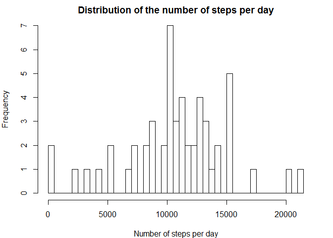
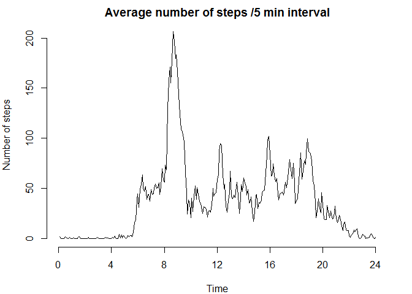
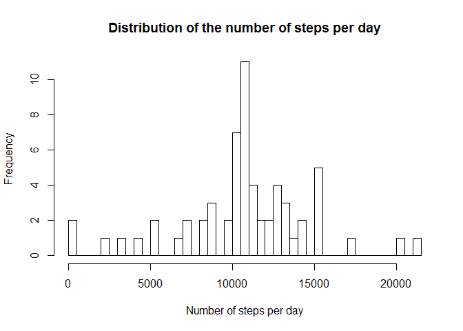
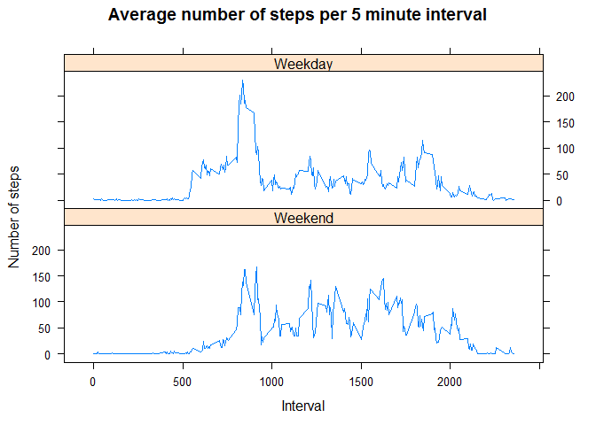

Reproducible Research: Peer Assessment 1
========================================================
Loading and preprocessing the data
----------------------------------

```r
activity <- read.csv("activity.csv")
```

What is mean total number of steps taken per day?
*Calculate the total number of steps taken per day

```r
tab1 <- na.omit(as.data.frame(tapply(activity$steps,as.factor(activity$date), sum)))
print(tab1)
```

```
##            tapply(activity$steps, as.factor(activity$date), sum)
## 2012-10-02                                                   126
## 2012-10-03                                                 11352
## 2012-10-04                                                 12116
## 2012-10-05                                                 13294
## 2012-10-06                                                 15420
## 2012-10-07                                                 11015
## 2012-10-09                                                 12811
## 2012-10-10                                                  9900
## 2012-10-11                                                 10304
## 2012-10-12                                                 17382
## 2012-10-13                                                 12426
## 2012-10-14                                                 15098
## 2012-10-15                                                 10139
## 2012-10-16                                                 15084
## 2012-10-17                                                 13452
## 2012-10-18                                                 10056
## 2012-10-19                                                 11829
## 2012-10-20                                                 10395
## 2012-10-21                                                  8821
## 2012-10-22                                                 13460
## 2012-10-23                                                  8918
## 2012-10-24                                                  8355
## 2012-10-25                                                  2492
## 2012-10-26                                                  6778
## 2012-10-27                                                 10119
## 2012-10-28                                                 11458
## 2012-10-29                                                  5018
## 2012-10-30                                                  9819
## 2012-10-31                                                 15414
## 2012-11-02                                                 10600
## 2012-11-03                                                 10571
## 2012-11-05                                                 10439
## 2012-11-06                                                  8334
## 2012-11-07                                                 12883
## 2012-11-08                                                  3219
## 2012-11-11                                                 12608
## 2012-11-12                                                 10765
## 2012-11-13                                                  7336
## 2012-11-15                                                    41
## 2012-11-16                                                  5441
## 2012-11-17                                                 14339
## 2012-11-18                                                 15110
## 2012-11-19                                                  8841
## 2012-11-20                                                  4472
## 2012-11-21                                                 12787
## 2012-11-22                                                 20427
## 2012-11-23                                                 21194
## 2012-11-24                                                 14478
## 2012-11-25                                                 11834
## 2012-11-26                                                 11162
## 2012-11-27                                                 13646
## 2012-11-28                                                 10183
## 2012-11-29                                                  7047
```
* Make a histogram of the total number of steps taken each day

```r
par(mar=c(4,4,2,2), cex=1)

hist(tab1[,1], xlab="Number of steps per day", breaks=61,
     main="Distribution of the number of steps per day")
```

 
*Calculate and report the mean and median of the total number of steps taken per day

```r
summary = summary(tab1)
c(summary[4],summary[3])
```

```
## [1] "Mean   :10766  " "Median :10765  "
```

What is the average daily activity pattern?
-------------------------------------------
*Make a time series plot (i.e. type = "l") of the 5-minute interval (x-axis) and the average number of steps taken, averaged across all days (y-axis)

```r
activityVals <- subset(activity,!is.na(activity$steps))
tab2 <- tapply(activityVals$steps,as.factor(activityVals$interval), mean)

par(mar=c(4,4,2,2), cex=1)

plot(tab2, xlab="Time", axes=FALSE, ylab="Number of steps", 
     main="Average number of steps /5 min interval",
     type="l")
axis(2)
axis(1, at=c(0,48,96,144,192,240,288), labels=c("0","4","8","12","16","20","24")) 
```

 
*Which 5-minute interval, on average across all the days in the dataset, contains the maximum number of steps?

```r
rownames(tab2)[match(max(tab2),tab2)]
```

```
## [1] "835"
```

Imputing missing values
--------------------------------
*Imputing missing values

```r
sum(is.na(activity$steps))
```

```
## [1] 2304
```
*Devise a strategy for filling in all of the missing values in the dataset. The strategy does not need to be sophisticated. For example, you could use the mean/median for that day, or the mean for that 5-minute interval, etc.

```r
library(stringr)

fill <- function(row) {
  
  if(is.na(row[1]))
    row[1] <- round(tab2[as.character(as.integer(row[3]))])
  
  return(row)
}
activityFilled <- as.data.frame(aperm(apply(activity,1,fill),perm=c(2,1)))
```
*Create a new dataset that is equal to the original dataset but with the missing data filled in.

```r
tab3 <- tapply(as.integer(as.character(activityFilled$steps)),
               as.factor(activityFilled$date), sum)
```
*Make a histogram of the total number of steps taken each day and Calculate and report the mean and median total number of steps taken per day. Do these values differ from the estimates from the first part of the assignment? What is the impact of imputing missing data on the estimates of the total daily number of steps?

```r
hist(tab3, xlab="Number of steps per day", breaks=61,
main="Distribution of the number of steps per day")
```

 

```r
summary = summary(tab3)
c(summary[4],summary[3])
```

```
##   Mean Median 
##  10770  10760
```
By filling in days without data with the mean of steps over all days, obviously, the mean and median of steps only changes a little, in particular the median should get closer to the mean.
Moreover, the number of days has increased, with the additional days all having very close to the mean of steps and therefore being added to the middle bin. 

Are there differences in activity patterns between weekdays and weekends?
------------------------------------------------------------------------
*Create a new factor variable in the dataset with two levels – “weekday” and “weekend” indicating whether a given date is a weekday or weekend day.

```r
Sys.setlocale("LC_TIME", "English")
```

```
## [1] "English_United States.1252"
```

```r
activityFilled$wDay <- 
  as.factor(ifelse((weekdays(as.Date(activityFilled[[2]])) == "Sunday" | 
                    weekdays(as.Date(activityFilled[[2]])) == "Saturday"), 
                   "weekend", "weekday"))

activityWE <- subset(activityFilled,(activityFilled$wDay=="weekend"))
activityWD <- subset(activityFilled,(activityFilled$wDay=="weekday"))
```
*Make a panel plot containing a time series plot (i.e. type = "l") of the 5-minute interval (x-axis) and the average number of steps taken, averaged across all weekday days or weekend days (y-axis). 

```r
tabWD <- data.frame(matrix(NA, nrow = 288, ncol = 0))
tabWD$interval <- as.integer(rownames(tab2))
tabWD$steps <- tapply(as.integer(as.character(activityWD$steps)),
                as.factor(activityWD$interval), mean)
tabWD$day <- as.factor(rep("Weekday", 288))

tabWE <- data.frame(matrix(NA, nrow = 288, ncol = 0))
tabWE$interval <- as.integer(rownames(tab2))
tabWE$steps <- tapply(as.integer(as.character(activityWE$steps)),
                as.factor(activityWE$interval), mean)
tabWE$day <- as.factor(rep("Weekend", 288))

tab4 = rbind(tabWE, tabWD)

library(lattice)
xyplot(steps~interval|day, data = tab4, type="l",
   main="Average number of steps per 5 minute interval",
   xlab="Interval",
   ylab="Number of steps",
   layout=c(1,2))
```

 
